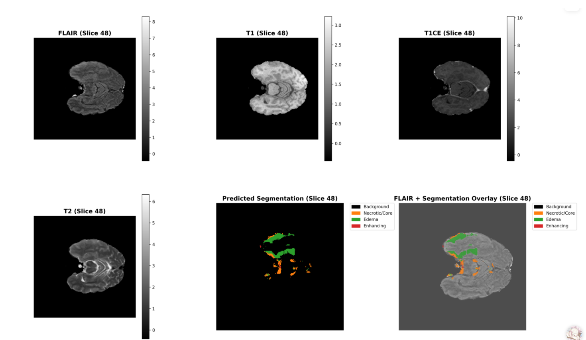
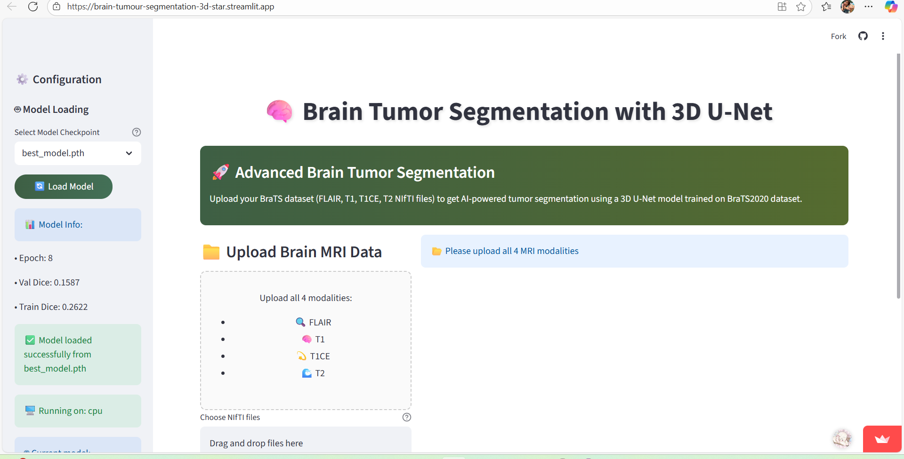
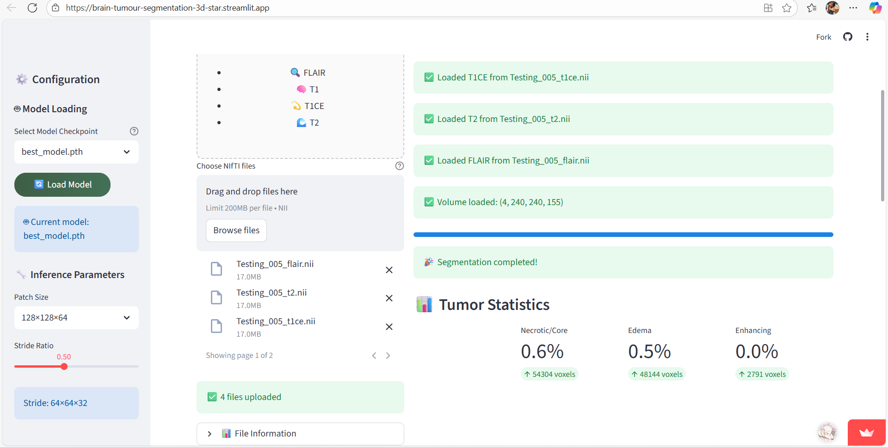
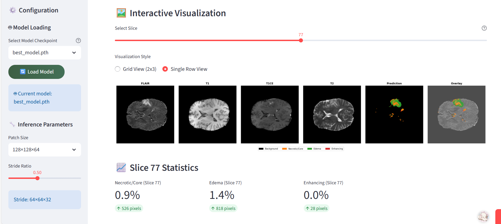

<h1 align="center">🧠 Brain Tumor Segmentation using 3D U-Net</h1>

A deep learning–based medical imaging project that performs automatic brain tumor segmentation from multimodal MRI scans. 
Built around a <b>3D U-Net</b> architecture and deployed with a fully functional <b>Streamlit web app</b>, this pipeline covers everything from preprocessing to interactive inference.

<h2>📑 Contents</h2>

<ul>
  <li><a href="#-overview">Overview</a></li>
  <li><a href="#-highlights">Features</a></li>
  <li><a href="#-dataset">Dataset</a></li>
  <li><a href="#-model-architecture">Model Architecture</a></li>
  <li><a href="#-training">Training</a></li>
  <li><a href="#-inference">Inference</a></li>
  <li><a href="#-web-application">Web Application</a></li>
  <li><a href="#-results">Results</a></li>
</ul>

<h2>🪄 Overview</h2>

Brain tumor segmentation plays a vital role in medical diagnosis and treatment planning. 
This project leverages <b>3D U-Net</b>, a deep convolutional neural network specialized for volumetric data, 
to segment MRI scans into multiple tumor subregions.

The model distinguishes four anatomical categories:

<ul>
  <li><b>Label 0:</b> Background</li>
  <li><b>Label 1:</b> Necrotic / Non-enhancing core</li>
  <li><b>Label 2:</b> Peritumoral edema</li>
  <li><b>Label 3:</b> GD-enhancing tumor</li>
</ul>

  

<h2 id="highlights">✨ Features</h2>

<ul>
  <li><b>3D U-Net Backbone:</b> Optimized for volumetric medical image segmentation.</li>
  <li><b>Multi-Modal MRI Input:</b> Uses T1, T1CE, T2, and FLAIR modalities.</li>
  <li><b>Patch-wise Training:</b> Reduces memory consumption and supports large 3D volumes.</li>
  <li><b>Smart Augmentation:</b> Uses <i>TorchIO</i> for realistic 3D data transformations.</li>
  <li><b>Hybrid Loss Function:</b> Combines Dice and Cross-Entropy losses for balanced optimization.</li>
  <li><b>Streamlit Web App:</b> Interactive tool for visualization and real-time segmentation.</li>
  <li><b>Evaluation Metrics:</b> Dice scores and volume stats for all tumor regions.</li>
  <li><b>Early Stopping:</b> Monitors validation loss to avoid overfitting.</li>
</ul>

<h2>📊 Dataset</h2>

The project utilizes the <b>BraTS 2020</b> dataset (Multimodal Brain Tumor Segmentation Challenge):

<ul>
  <li><b>Training Data:</b> 369 subjects</li>
  <li><b>Validation Data:</b> 125 subjects</li>
  <li><b>Modalities:</b> T1, T1CE, T2, FLAIR</li>
  <li><b>Resolution:</b> 240×240×155 voxels</li>
  <li><b>Labels:</b> Expert-annotated tumor masks</li>
</ul>

<h3>🧩 Preprocessing Steps</h3>

<ul>
  <li><b>Z-score Normalization</b> per modality</li>
  <li><b>Label Adjustment:</b> Remaps label 4 → 3 for uniformity</li>
  <li><b>Patch Sampling:</b> Extracts 3D patches (128×128×64) with overlapping strides</li>
  <li><b>Tumor-Aware Sampling:</b> Ensures a balanced ratio of tumor vs non-tumor regions</li>
</ul>

<h2 id="architecture">🏗️ Model Architecture</h2>

The model implements a <b>3D U-Net</b> architecture optimized for volumetric medical image segmentation.

<pre style="background-color:#0d1117;color:#e6edf3;padding:16px;border-radius:10px;overflow-x:auto;font-family:'Fira Code', monospace;font-size:14px;line-height:1.6;">
<b>Input:</b> [Batch, 4, 128, 128, 64]  → (4 MRI modalities)
├── <b>Encoder Path</b>
│   ├── Conv3D Block 1: [4 → 16] + MaxPool3D
│   ├── Conv3D Block 2: [16 → 32] + MaxPool3D
│   ├── Conv3D Block 3: [32 → 64] + MaxPool3D
│   ├── Conv3D Block 4: [64 → 128] + MaxPool3D
│   └── Bottleneck: [128 → 256]
└── <b>Decoder Path</b>
    ├── UpConv + Skip 4: [256 + 128 → 128]
    ├── UpConv + Skip 3: [128 + 64 → 64]
    ├── UpConv + Skip 2: [64 + 32 → 32]
    ├── UpConv + Skip 1: [32 + 16 → 16]
    └── Final Conv: [16 → 4] → (class probabilities)

<b>Output:</b> [Batch, 4, 128, 128, 64]
</pre>

<h3>🔑 Key Components</h3>

<ul>
  <li><b>Residual Connections:</b> Optional residual links within convolution blocks</li>
  <li><b>Batch Normalization:</b> Improves stability and convergence</li>
  <li><b>Dropout:</b> 3D dropout layers (rate = 0.2) for regularization</li>
  <li><b>Skip Connections:</b> Preserve spatial detail from encoder to decoder</li>
</ul>

<h2 id="training">🚧 Training</h2>

The training pipeline is designed for efficiency, scalability, and stability across large 3D medical volumes. 
Patch-based learning combined with smart augmentations ensures balanced representation of tumor and non-tumor regions.

<h3>⚙️ Key Training Features</h3>

<ul>
  <li><b>Patch-Based Learning:</b> Extracts overlapping 3D patches (128×128×64) to enable GPU-efficient training.</li>
  <li><b>Dynamic Data Augmentation:</b> Employs <b>TorchIO</b> for random flips, elastic deformations, gamma correction, and noise injection.</li>
  <li><b>Hybrid Loss Function:</b> Combines <b>Dice</b> and <b>Cross-Entropy</b> to handle class imbalance and refine boundary accuracy.</li>
  <li><b>Checkpointing & Monitoring:</b> Saves best model weights based on validation loss with live metric logging.</li>
  <li><b>Early Stopping:</b> Automatically halts training when validation loss stagnates for defined epochs.</li>
  <li><b>Mixed Sampling Strategy:</b> Ensures an optimal ratio of tumor and background patches for balanced feature learning.</li>
</ul>

<pre style="background-color:#0d1117;color:#e6edf3;padding:16px;border-radius:10px;overflow-x:auto;font-family:'Fira Code', monospace;font-size:14px;line-height:1.6;">
# Configure paths and hyperparameters
TRAIN_DATASET_PATH = '/path/to/BraTS2020_TrainingData'
NUM_EPOCHS = 16
BATCH_SIZE = 2
LEARNING_RATE = 1e-5

# Initialize model, loss, optimizer
model = UNet3D_BraTS(in_channels=4, num_classes=4)
criterion = CombinedLoss(num_classes=4, alpha=0.5)
optimizer = torch.optim.AdamW(model.parameters(), lr=LEARNING_RATE)

# Start training
python train.py
</pre>
---

<h2 id="inference">🚀 Inference</h2>

After successful training, the model can be deployed for 3D brain tumor segmentation on unseen MRI scans.
The inference pipeline processes full patient volumes, applies preprocessing, and generates voxel-wise probability maps.

<h3>🔍 Inference Workflow</h3>

<ul>
  <li><b>Model Loading:</b> Automatically restores weights from the best-performing checkpoint (<code>best_model.pth</code>).</li>
  <li><b>Preprocessing:</b> Normalizes modalities, resamples voxel spacing, and aligns input dimensions.</li>
  <li><b>Patch Aggregation:</b> Segmentation is performed on overlapping 3D patches which are stitched seamlessly into the full volume.</li>
  <li><b>Post-Processing:</b> Removes small false-positive clusters and smooths class boundaries.</li>
  <li><b>Visualization:</b> Outputs 3D overlays, slice-wise heatmaps, and volume statistics for each tumor region.</li>
  <li><b>Deployment:</b> Integrated Streamlit web interface allows real-time upload and visualization for new patient scans.</li>
</ul>

<h2>🌐 Web Application</h2>

  <strong>🚀 Try It Yourself</strong> 
  Experience the complete brain tumor segmentation workflow here: 
  👉 <a href="https://brain-tumour-segmentation-3d-star.streamlit.app/" target="_blank" rel="noopener noreferrer">Launch Web App</a>

The project presents an advanced <b>Streamlit web application</b> designed for medical professionals and researchers to perform <b>brain tumor segmentation</b> without any coding expertise. It provides an intuitive interface for visualizing MRI data, running automated segmentation, and analyzing tumor regions in real-time.

  

<h3>💡 Application Workflow</h3>
<ul>
  <li><b>1. Model Loading:</b> The application automatically detects available model checkpoint files (<code>.pth</code>) in the working directory. Select your trained model from the dropdown list and click <b>“🔄 Load Model”</b> to initialize the 3D U-Net for inference.</li>
  
  <li><b>2. File Upload:</b> Upload all four MRI modalities for each patient — <b>FLAIR</b> (Fluid Attenuated Inversion Recovery), <b>T1</b>, <b>T1CE</b> (T1-weighted contrast-enhanced), and <b>T2</b>.  
   <b>Requirements:</b>
    <ul>
      <li>Accepted format: <code>.nii</code> (NIfTI)</li>
      <li>All four modalities must be uploaded</li>
      <li>File names should follow BraTS conventions (e.g., <code>patient_flair.nii</code>)</li>
    </ul>
  </li>

  <li><b>3. Configuration Settings:</b> Adjust inference parameters from the sidebar to control performance and accuracy:
    <ul>
      <li><b>Patch Size:</b> Choose from 96×96×48, 128×128×64, or 160×160×80</li>
      <li><b>Stride Ratio:</b> Set overlap between patches (0.3–0.8). Higher overlap improves quality but increases processing time.</li>
    </ul>
  </li>

  

  <li><b>4. Running Segmentation:</b> Click <b>“🚀 Run Segmentation”</b> to start the inference process. A progress bar provides real-time updates. The complete brain volume is typically processed in under one minute.</li>

  <li><b>5. Results Visualization:</b> Navigate through segmented slices interactively using a slider. Choose between:
    <ul>
      <li><b>Grid View (2×3):</b> Displays all four MRI modalities along with segmentation and overlay results.</li>
      <li><b>Single Row View:</b> Optimized for mobile viewing.</li>
    </ul>
  </li>

  <li><b>6. Statistical Analysis:</b> View detailed tumor metrics for deeper insight:
    <ul>
      <li><b>Volume Statistics:</b> Displays percentage of each tumor region and voxel counts for quantitative analysis, color-coded for easy interpretation.</li>
      <li><b>Per-Slice Analysis:</b> Provides region breakdowns for each slice, updating dynamically as you navigate.</li>
    </ul>
  </li>
</ul>

  

<h3>⚡ Web Application Features</h3>
<ul>
  <li>🖼️ <b>Advanced Visualization:</b> Multi-modal MRI display with transparent segmentation overlays and interactive navigation. Works seamlessly across desktop, tablet, and mobile devices.</li>
  <li>📊 <b>Real-time Analytics:</b> Automatic tumor volume quantification, live progress tracking, and memory-efficient processing for large MRI datasets.</li>
  <li>🎨 <b>User Interface:</b> Drag-and-drop uploads, modern medical-grade styling, and a responsive layout that adapts to all screen sizes.</li>
  <li>⚙️ <b>Error Handling & Optimization:</b> Built-in checks for missing or incorrect file formats with smooth error recovery and efficient GPU memory management.</li>
</ul>

<h3>🌈 Tumor Region Color Coding</h3>

The segmentation output uses standardized color conventions for clear differentiation of tumor regions:

<table>
<tr><th>Region</th><th>Color</th><th>Description</th></tr>
<tr><td>Background</td><td>⬛ Black</td><td>Normal brain tissue</td></tr>
<tr><td>Necrotic Core</td><td>🟧 Orange</td><td>Non-enhancing necrotic tumor core</td></tr>
<tr><td>Edema</td><td>🟩 Green</td><td>Peritumoral edema (swelling)</td></tr>
<tr><td>Enhancing Tumor</td><td>🟥 Red</td><td>Gadolinium-enhancing active tumor region</td></tr>
</table>

<h2>📈 Results</h2>
<h3>🧮Model Performance</h3>

<table>
<tr><th>Metric</th><th>Score</th></tr>
<tr><td>Mean Dice Score</td><td>0.65+</td></tr>
<tr><td>Necrotic Core Dice</td><td>0.52+</td></tr>
<tr><td>Edema Dice</td><td>0.52+</td></tr>
<tr><td>Enhancing Dice</td><td>0.50+</td></tr>
</table>

<h3>🧪 Training Insights</h3>
<ul>
  <li><b>Convergence:</b> Model typically converges within 8–16 epochs</li>
  <li><b>Memory Usage:</b> ~8 GB GPU memory required for batch size 2</li>
  <li><b>Processing Time:</b> Around 1 minute per patient during inference</li>
  <li><b>Patch Strategy:</b> 50% overlap yields optimal segmentation quality</li>
</ul>

  

<h2>🏥 Applications</h2>
<ul>
  <li><b>Tumor Volume Quantification:</b> Automated measurement for treatment monitoring</li>
  <li><b>Surgical Planning:</b> Precise tumor boundary delineation</li>
  <li><b>Treatment Response Assessment:</b> Longitudinal volume change tracking</li>
  <li><b>Clinical Trials:</b> Standardized endpoint evaluation</li>
  <li><b>Screening Programs:</b> Large-scale automated analysis</li>
</ul>

<h4>🧾 Clinical Validation Notes</h4>

⚠️ <b>Important:</b> This is a research implementation. Clinical use requires:

<ul>
  <li>Regulatory approval (FDA, CE marking, etc.)</li>
  <li>Extensive clinical validation</li>
  <li>Integration with PACS systems</li>
  <li>Radiologist oversight and validation</li>
</ul>

<h3>📚 References</h3>
<ul>
  <li>Çiçek, Ö., et al. “3D U-Net: Learning Dense Volumetric Segmentation from Sparse Annotation.” MICCAI 2016.</li>
  <li>Menze, B. H., et al. “The Multimodal Brain Tumor Image Segmentation Benchmark (BraTS).” IEEE TMI 2015.</li>
  <li>Pérez-García, F., et al. “TorchIO: a Python library for efficient loading, preprocessing, augmentation and patch-based sampling of medical images.” CMIG 2021.</li>
  <li>Zhang, Y., Lu, Y., Chen, W., Chang, Y., Gu, H., Yu, B. “Brain Tumour Segmentation Based on an Improved U-Net.” BMC Medical Imaging 2022.</li>
  <li>BiTr-Unet: a CNN-Transformer Combined Network for MRI Brain Tumour Segmentation. PMC, 2022.</li>
  <li>“A Review of Deep Learning for Brain Tumour Analysis in MRI.” PMC, 2024.</li>
  <li>“Brain Tumor Segmentation Using an Ensemble of 3D U-Nets and …” Frontiers in Computational Neuroscience, 2020.</li>
</ul>

<h2>🙏 Acknowledgments</h2>
<ul>
  <li><b>BraTS Challenge</b> for dataset access</li>
  <li><b>PyTorch</b> developers for the DL framework</li>
  <li><b>Streamlit</b> community for UI tools</li>
  <li>Open-source contributors in medical imaging</li>
</ul>

<h2>⚠️ Disclaimer</h2>

This implementation is for <b>research and educational use only</b>.  
It is not approved for clinical or diagnostic applications.  
Always consult certified medical professionals before applying any results in real-world healthcare settings.

🤖 Built with passion for AI, deep learning, and healthcare.

